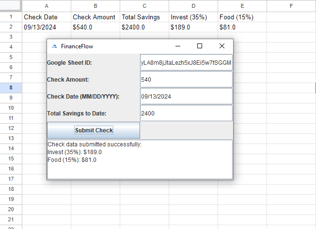

## Features

- **Check Tracking**: Easily input your check amount and the date it was received.
- **Savings Allocation**: Automatically allocates 35% of your check toward savings.
- **Food Expense Allocation**: Allocates 15% of your check toward food expenses.
- **Savings Goal Progress**: Set savings goals and track your progress over time.
- **Google Sheets Integration**: Export check details and financial data directly to Google Sheets.
- **User-Friendly GUI**: A simple, intuitive graphical interface to manage your finances.



## Technologies Used

- **Java**: Core application logic.
- **Swing**: Graphical User Interface (GUI).
- **Google Sheets API**: Integration to export data to Google Sheets.
- **Maven**: Project build and dependency management.

## To use this application with Google Sheets, you will need to set up your own Google Cloud project and enable the Google Sheets API.

1. **Create a Google Cloud Project**:
    - Go to [Google Cloud Console](https://console.cloud.google.com/).
    - Click **Create Project** and give your project a name.

2. **Enable the Google Sheets API**:
    - Navigate to **APIs & Services > Library**.
    - Search for **Google Sheets API** and click **Enable**.

3. **Create OAuth 2.0 Credentials**:
    - Go to **APIs & Services > Credentials**.
    - Click **Create Credentials** > **OAuth 2.0 Client IDs**.
    - Configure the consent screen (internal testing or external if you want others to use it).
    - Download the `credentials.json` file.

4. **Place the `credentials.json` File**:
    - Place the `credentials.json` file in the `src/main/resources` directory of the project.

### Running the Application

1. **Clone the Repository**:
   ```bash
   git clone https://github.com/YOUR_USERNAME/FinanceFlow.git
   cd FinanceFlow
